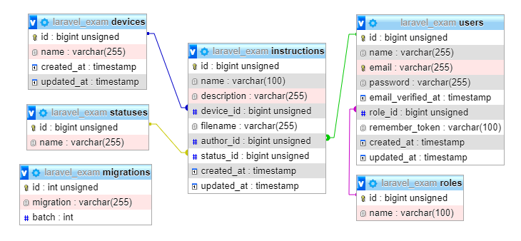

Создать веб-проект «Инструкции для техники».

Очень часто возникает необходимость найти потерянную инструкцию. Например, для холодильника или стиральной машины.
Основная задача проекта предоставить удобный интерфейс
для поиска, чтения и размещения инструкций для техники.

Проект должен позволять пользователю:
<ul style="list-style: none">
<li>&#9989; Искать инструкцию по текстовому шаблону. 
Пользователь вводит название технического прибора для поиска.</li>
<li>&#10060; Читать найденную инструкцию.</li>
<li>&#9989; Скачивать найденную инструкцию.</li>
<li>&#10060; Пожаловаться на инструкцию администрации проекта. 
При жалобе пользователь должен указать в чём суть жалобы.</li>
<li>&#9989; Зарегистрироваться на портале. Регистрация является обязательной для загрузки инструкции. Регистрация должна
быть реализована через собственную форму веб-проекта. При входе и регистрации кроме пароля и логина, необходимо предусмотреть защиту по CAPTCHA.</li>
<li>&#11093; Загрузить инструкцию на портал. При загрузке необходимо дать описание инструкции. Загруженная инструкция станет доступной для пользователей только после
утверждения администрацией проекта.</li>
</ul>

Проект должен иметь административную часть. Она должна позволять:
<ul style="list-style: none">
<li>&#11093; Добавлять/удалять инструкции.</li>
<li>&#11093; Одобрять инструкции, загруженные пользователем.</li>
<li>&#11093; Добавлять/удалять/блокировать/разблокировать пользователей.</li>
</ul>

